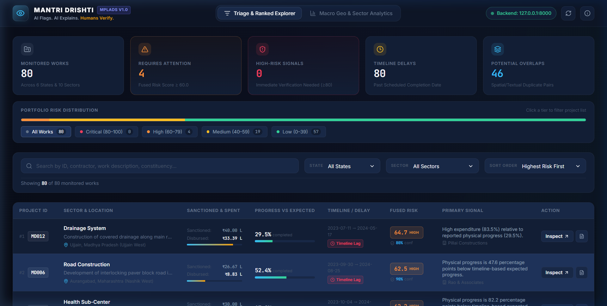
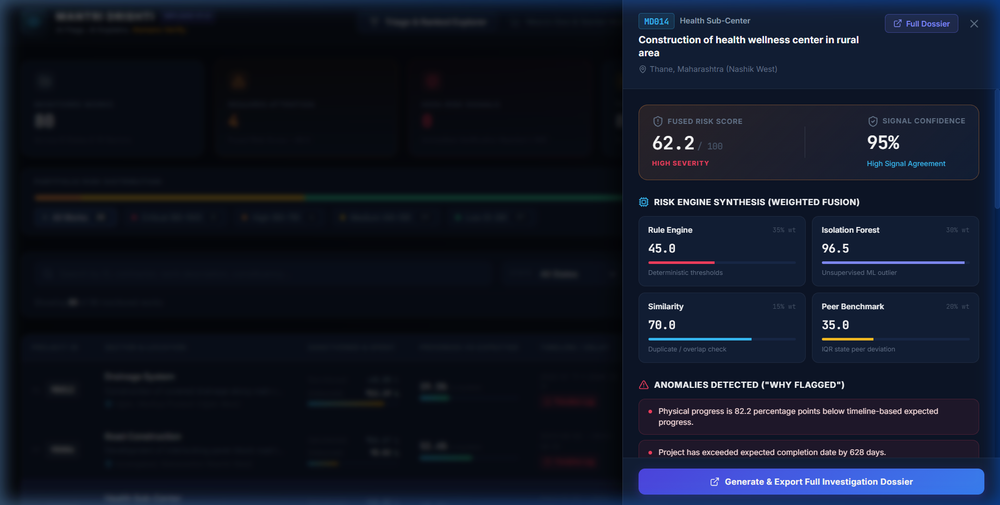
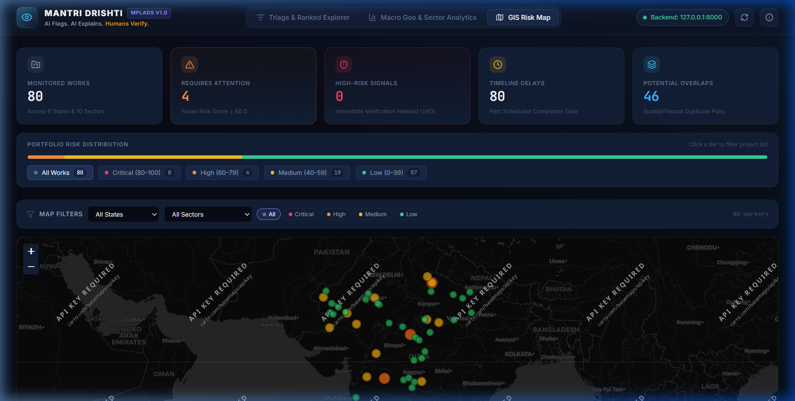

# Mantri Drishti

> **AI Flags. AI Explains. Humans Verify.**

AI-Powered Risk Intelligence Platform for MPLADS (Member of Parliament Local Area Development Scheme) Projects.


---

## What It Does

Mantri Drishti detects anomalies, financial mismatches, timeline delays, and overlapping/duplicate works in MPLADS public expenditure. It synthesizes risk intelligence into **explainable investigation dossiers** to prioritize human field verification and audit actions.

### Key Capabilities

- **Multi-Engine Risk Fusion** — Combines 4 independent analytical engines into a single calibrated Risk Score (0–100)
- **Explainable AI** — Every flag comes with plain-English reasons ("Why Flagged"), not black-box alarms
- **Confidence Scoring** — Measures data completeness + signal agreement so auditors know how much to trust each flag
- **Investigation Dossiers** — Structured audit reports with evidence, peer comparison, verification steps, and statutory disclaimers
- **Interactive Dashboard** — React-based frontend with interactive Plotly charts, ranked project tables, and drill-down views

---

## Screenshots

### Projects — Triage & Ranked Explorer


### Analytics — Interactive Plotly Charts


### Investigation Drawer — Project Intelligence


### GIS Risk Map — Geospatial Analysis


---

## Architecture

```
mantri-drishti/
├── backend/                     # FastAPI + Python
│   ├── app/
│   │   ├── api/                 # REST endpoints (projects.py, risk.py)
│   │   ├── core/                # Configuration & thresholds (config.py)
│   │   ├── db/                  # SQLAlchemy ORM models + SQLite setup
│   │   ├── schemas/             # Pydantic request/response schemas
│   │   └── services/            # Business logic & intelligence engines
│   │       ├── anomaly_detection.py   # Rule Engine (6 rules) + Isolation Forest
│   │       ├── similarity.py          # TF-IDF + Haversine multi-signal overlap
│   │       ├── dossier.py             # IQR-based peer benchmarking
│   │       ├── risk_engine.py         # Orchestrator + fusion + confidence
│   │       └── project_service.py     # CSV ingestion + fingerprint computation
│   ├── data/
│   │   └── sample_projects.csv  # 80 synthetic projects (6 states, 10 work types)
│   ├── generate_data.py         # Synthetic dataset generator with planted anomalies
│   ├── seed.py                  # Full pipeline runner (ingest → analyze → persist)
│   ├── requirements.txt
│   └── mantri_drishti.db        # SQLite database (generated)
│
└── frontend/                    # React + Vite + TypeScript
    └── src/
        ├── components/          # UI components (Header, ProjectTable, DossierModal, etc.)
        ├── services/            # API client + mock data fallback
        ├── styles/              # Vanilla CSS design system
        └── types/               # TypeScript type definitions
```

---

## Four-Engine Intelligence Architecture

| Engine | Weight | Method | What It Detects |
|---|---|---|---|
| **Rule Engine** | 35% | Deterministic threshold checks | High expenditure vs low progress, large progress gaps, severe delays, stalled projects |
| **Isolation Forest** | 30% | Unsupervised ML (scikit-learn) | Statistical outliers across 8 financial + temporal features |
| **Similarity Engine** | 15% | TF-IDF text + Haversine geo + amount + entity matching | Duplicate/overlapping works (requires ≥3 converging signals) |
| **Peer Benchmark** | 20% | IQR statistics on state+sector peer cohorts | Projects deviating significantly from comparable peers |

**Risk Score** = 0.35 × Rules + 0.30 × IF + 0.15 × Similarity + 0.20 × Peer → **0–100**

**Confidence Score** = Data Completeness (50 pts) + Signal Agreement (50 pts) → **0–100**

---

## API Endpoints

| Method | Endpoint | Description |
|---|---|---|
| `GET` | `/` | Health check |
| `GET` | `/overview` | Dashboard statistics (risk distribution, top states, work types) |
| `GET` | `/projects` | Ranked project list with filters (state, district, risk range, sort) |
| `GET` | `/projects/{id}` | Full project detail with fingerprint features |
| `GET` | `/projects/{id}/fingerprint` | 5-dimensional behavioral fingerprint |
| `GET` | `/projects/{id}/risk` | Risk score breakdown by engine + "Why Flagged" |
| `GET` | `/projects/{id}/dossier` | Full investigation dossier with evidence and verification steps |

---

## Quick Start

### Prerequisites

- Python 3.10+
- Node.js 18+

### 1. Backend

```bash
cd backend

# Create virtual environment
python -m venv .venv
.venv\Scripts\activate        # Windows
# source .venv/bin/activate   # macOS/Linux

# Install dependencies
pip install -r requirements.txt

# Generate synthetic data + seed database + run intelligence engines
python generate_data.py
python seed.py

# Start the API server
uvicorn app.main:app --reload
```

The backend will be available at **http://127.0.0.1:8000**
- Swagger UI: http://127.0.0.1:8000/docs
- ReDoc: http://127.0.0.1:8000/redoc

### 2. Frontend

```bash
cd frontend

# Install dependencies
npm install

# Start the dev server
npm run dev
```

The frontend will be available at **http://localhost:5173**

> **Note:** The frontend has a built-in mock data fallback. If the backend is offline, it will automatically switch to demonstration mode with sample data.

### 3. Docker (One Command)

```bash
docker-compose up --build
```

- **Backend:** http://localhost:8000
- **Frontend:** http://localhost:3000

---

## Fingerprint Features

Every project is profiled across 5 dimensions with 8 computed features:

| Dimension | Features |
|---|---|
| **Financial** | `expenditure_ratio`, `release_ratio`, `spending_velocity` |
| **Progress** | `expected_progress`, `progress_gap` |
| **Temporal** | `planned_duration_days`, `elapsed_days`, `delay_days` |
| **Geographic** | `latitude`, `longitude` |
| **Entity** | `agency`, `contractor` |

---

## Sample Dossier Output (MD001)

```
Risk:       57.0 / 100
Confidence: 95.0 / 100
Contractor: Apex Infra Solutions

Why Flagged:
  1. High expenditure (86.9%) vs physical progress (32.3%)
  2. Progress gap: 67.7 percentage points behind schedule
  3. Delayed 983 days past expected completion
  4. Potentially overlapping project MD047 detected

Verification:
  - Verify physical progress on site
  - Review expenditure and sanction records
  - Investigate reasons for timeline delay
  - Compare work location with related projects

Disclaimer: Risk signals for human verification. Not proof of fraud.
```

---

## Tech Stack

| Layer | Technology |
|---|---|
| **Backend** | Python 3.10+, FastAPI 0.115, SQLAlchemy 2.0, SQLite |
| **ML / Analytics** | scikit-learn (Isolation Forest), Pandas, NumPy |
| **Frontend** | React 19, TypeScript 6, Vite 8, Plotly.js |
| **Styling** | Vanilla CSS (dark glass-morphism design system) |
| **Icons** | Lucide React |

---

## Statutory Disclaimer

> This platform identifies statistical risk signals for authorised human verification. It does not establish fraud or misconduct. All analysis results must be verified through proper institutional field inspection protocols.

---

## License

MIT
